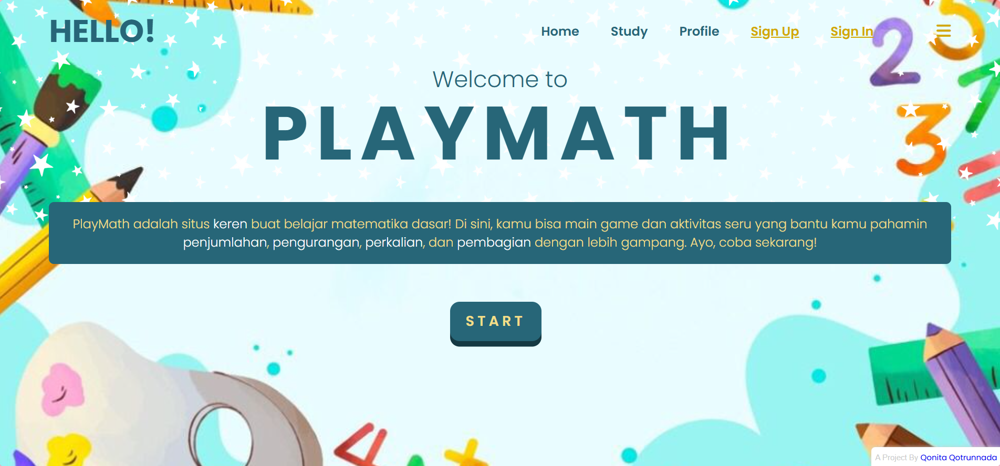
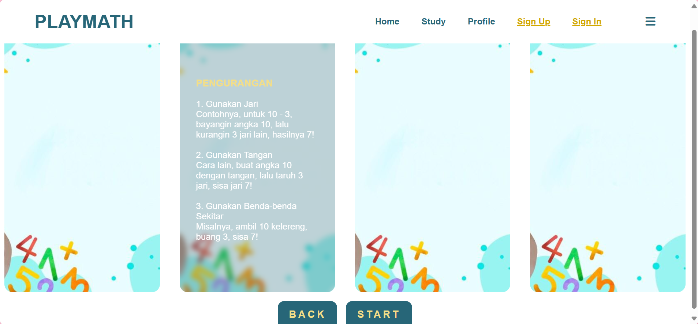
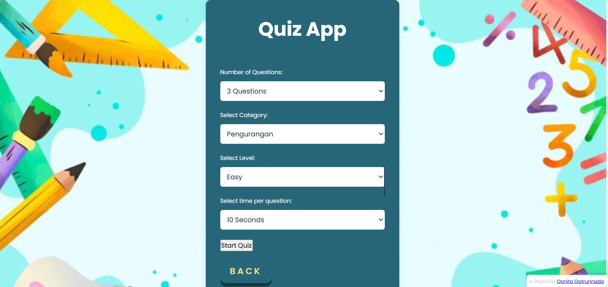
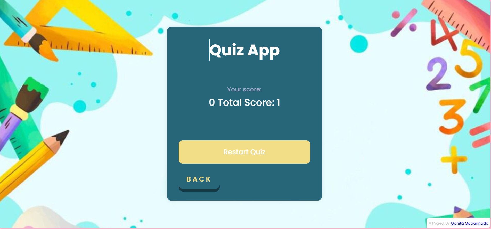
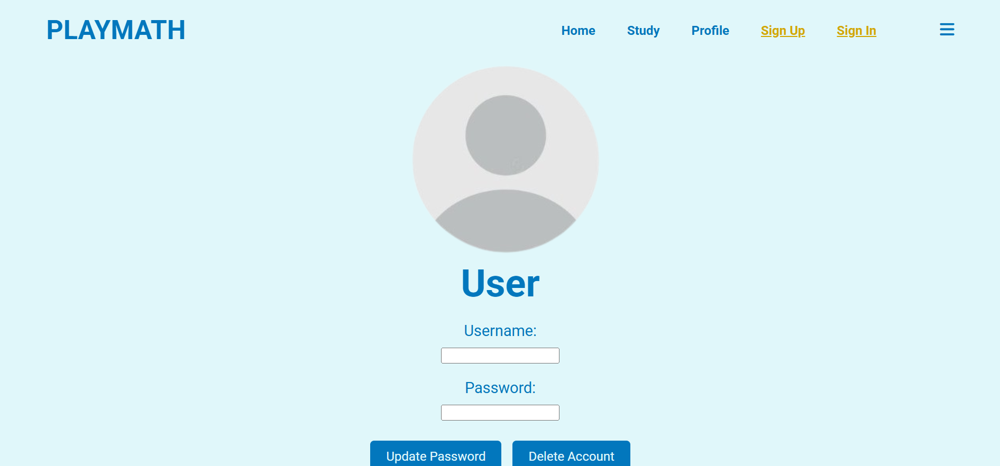

# 🔢 PlayMath – Fun Math Learning Website for Kids 🎮👶

Welcome to **PlayMath**, a colorful and interactive web application designed to help elementary school students practice their math skills — from **addition ➕, subtraction ➖, multiplication ✖️, to division ➗** — all through **fun quizzes and helpful tips!**

---

## 🎯 What is PlayMath?

**PlayMath** is a digital learning platform aimed at making math fun and engaging for kids.  
It provides:

- 📘 Simple **math tutorials** to explain how to count and calculate  
- 🧠 **Interactive quizzes** with adjustable difficulty  
- 🕐 **Timer & Question settings** to customize the quiz experience  
- ✅ Instant results showing **correct and incorrect answers**

Perfect for kids, parents, or teachers looking for a **productive math playtime!**

---

## 🧩 Features

- 📚 **Math Learning Pages**  
  - Clear and colorful explanations for each operation  
  - Easy-to-understand examples  

- 🎮 **Quiz Section**  
  - Choose your quiz topic: Addition, Subtraction, Multiplication, Division  
  - Set how many questions you want  
  - Pick the quiz duration  
  - Instant feedback after completion: number of correct and wrong answers

- 🧒 Friendly user interface designed for young learners  
- 📱 Works great on desktop and mobile devices!

---

## 🖼️ Preview

Add your screenshot here to show how it looks:

---

## ⚙️ Tech Stack
Built with:

- 🧱 HTML, CSS, JavaScript

- 🧩 Simple state management using JS

- 🎨 Kid-friendly UI/UX design

---

## 👨‍🏫 Ideal For:
- Parents who want to help their kids practice math at home 🏡

- Teachers who want a tool to support math exercises in class 🧑‍🏫

- Kids who want to make learning math more fun! 🎉

---

## 🤝 Let's Connect!
Have suggestions or want to collaborate? I’d love to hear from you!

💌 Linktr.ee: https://linktr.ee/qonitaqq

